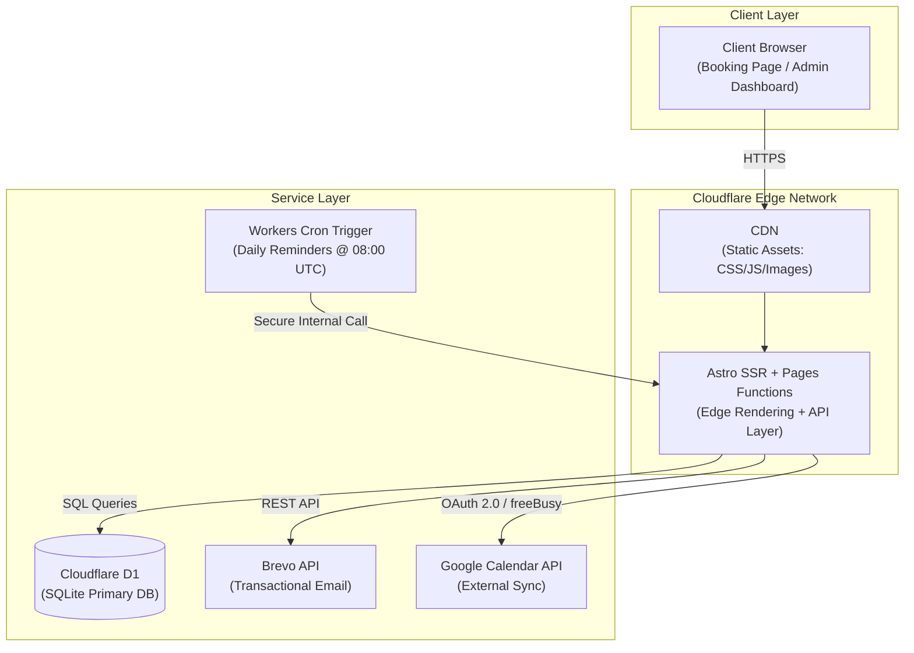
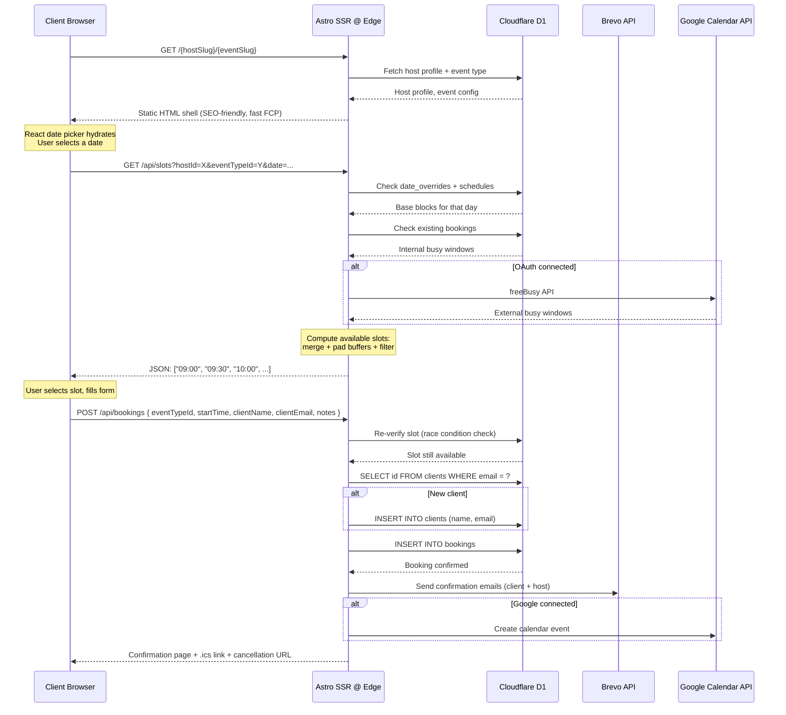
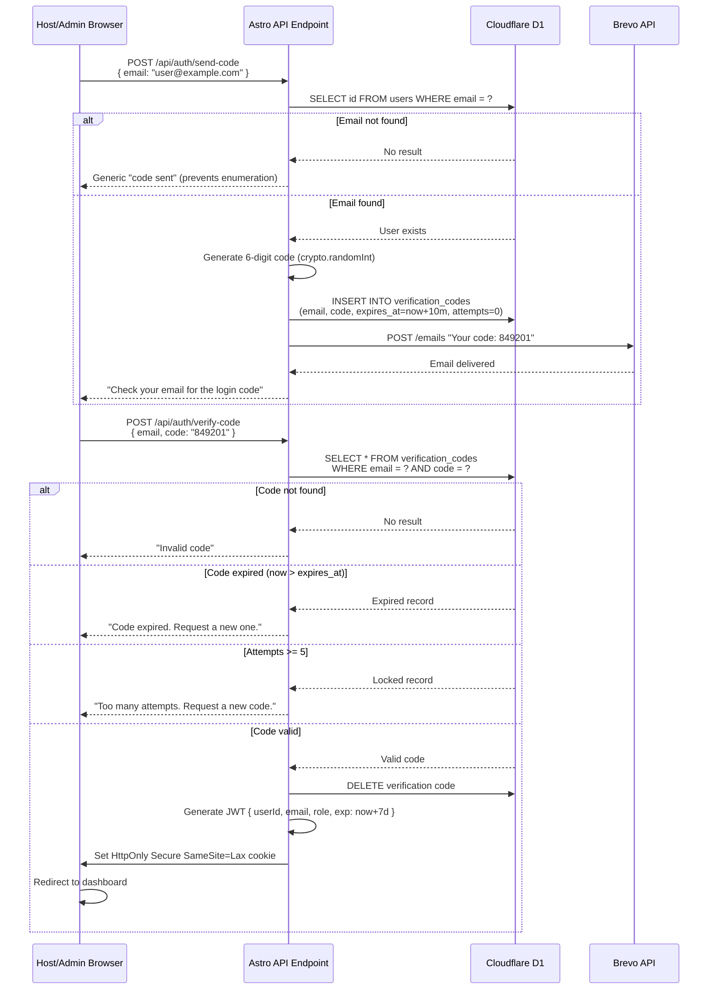
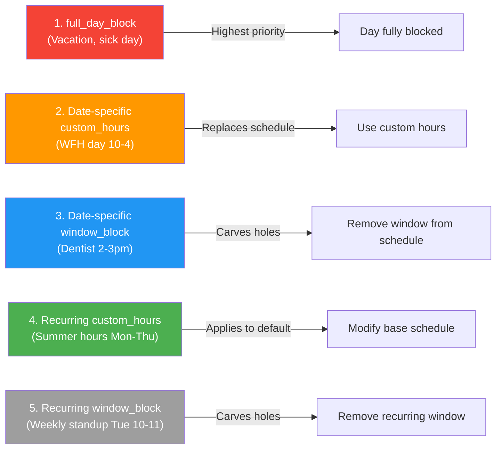
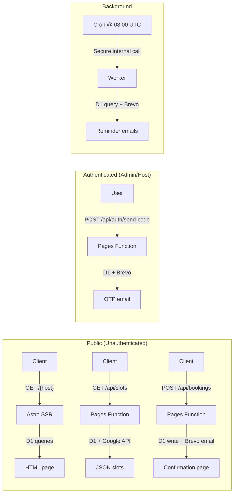

# PRD Section: System Design — OpenSchedule (Design a Calendly Replacement)

> **Format**: This document follows the **FAANG system design interview framework** — the same methodology used for "Design Twitter", "Design Instagram", "Design Uber", etc. Each step mirrors a whiteboard discussion: define scope, calculate capacity, sketch the architecture, dive deep, then scale.

---

## Step 1: Scope & Requirements

### Functional Requirements

| # | Requirement | Priority |
| :--- | :--- | :--- |
| FR1 | Hosts can define weekly availability (recurring schedules + date-specific overrides) | P0 |
| FR2 | Clients can view available time slots for a Host without logging in | P0 |
| FR3 | Clients can book a meeting; system prevents double-booking | P0 |
| FR4 | Client receives confirmation email with `.ics` attachment and cancellation link | P0 |
| FR5 | Host receives email notification when a booking is made | P0 |
| FR6 | Hosts can connect Google Calendar for external conflict detection | P1 |
| FR7 | System sends daily automated reminders to Clients for upcoming meetings | P1 |
| FR8 | Admin provisions Host accounts; no public signup | P1 |
| FR9 | Admin dashboard shows email usage quota | P2 |

### Non-Functional Requirements

| # | Requirement | Target |
| :--- | :--- | :--- |
| NFR1 | **Cost** — System must run at $0/month up to 1,000 MAU | No paid services |
| NFR2 | **Latency** — Public booking page loads in < 1 second on mobile | P95 < 1,000 ms |
| NFR3 | **Consistency** — No double-bookings allowed (strong consistency on writes) | Exactly-once |
| NFR4 | **Availability** — Booking page must be available even if email service is down | Degrade gracefully |
| NFR5 | **Durability** — All booking data persisted; no data loss on crash | ACID writes |

### Out of Scope

- Round-robin / team scheduling
- Video conferencing integration (Zoom, Meet)
- Mobile apps (native iOS/Android)
- Payment processing
- Machine learning for optimal slot suggestions
- Multi-language / i18n

---

## Step 2: Capacity Estimation (Back-of-the-Envelope)

### The Free-Tier Reality Check

Before estimating traffic, we must establish what our **free-tier limits actually support**. The tightest constraint — **Brevo's 300 emails/day** (not Resend's 100) — determines maximum deployment size. All other resources have orders of magnitude more headroom.

| Resource | Free Limit | Max Sustained (for our architecture) | Headroom vs 25-Host Need |
| :--- | :--- | :--- | :--- |
| Brevo transactional emails | **300/day** | ~25 Hosts / 125 bookings | **1× — defines scale** |
| Cloudflare D1 reads | 5,000,000/day | ~250× our need (20K/day) | **250×** |
| Cloudflare D1 writes | 100,000/day | ~833× our need (120/day) | **833×** |
| Pages Functions | 100,000/day | ~31× our need (3,200/day) | **31×** |
| Google Calendar API | 1,000,000/day | Effectively unlimited | **→10,000×** |

> **Email is the bottleneck that defines our scale.** Brevo's 300/day cap is 3× better than Resend's 100/day, but it's still the tightest constraint. All other resources have 31× to 10,000× headroom.

### Maximum Free-Tier Deployment

Working backward from the **300 email/day** cap (Brevo free plan):

| Assumption | Value |
| :--- | :--- |
| Emails per booking (client confirmation + host notification) | 2 |
| OTP emails reserved (Admin + Host logins) | 10/day |
| Cancellation emails reserved | 5/day |
| Daily reminders (batched per Host, not per booking) | 25/day |
| **Remaining for booking confirmations** | **260/day** |
| **Maximum bookings/day** | **130** |
| **Maximum Hosts** (at ~5 bookings/Host/day) | **~25** |

> **Bottom line**: The free tier comfortably supports **~25 Hosts, ~125 bookings/day, ~300 emails/day**. Brevo's 3× higher daily limit vs Resend is the single biggest free-tier optimization the system has.

### Traffic Estimates (25-Host Baseline)

| Metric | Daily Volume | Peak QPS | Avg QPS |
| :--- | :--- | :--- | :--- |
| Public booking page views | 2,500 views | 1.0 | 0.03 |
| Slot availability checks | 7,500 checks | 2.5 | 0.09 |
| Bookings created | 125 bookings | 0.15 | 0.001 |
| Emails sent | 300 (capped) | 0.3 | 0.003 |
| Admin/Host sessions | 50 logins | 0.02 | 0.0006 |

**Key insight**: At free-tier scale, peak QPS never exceeds 2.5 requests/second. There is zero need for horizontal scaling, load balancers, or distributed caching. Every component fits comfortably on a single serverless function.

### Storage Estimates (3-Year Projection for 25-Host Deployment)

| Entity | Row Size | Annual Rows | 3-Year Total |
| :--- | :--- | :--- | :--- |
| Users | 250 B | 27 | 20 KB |
| Clients | 150 B | 6,000 | 2.7 MB |
| Bookings | 400 B | 45,625 | 54.7 MB |
| Event Types | 300 B | 75 | 67 KB |
| Schedules | 100 B | 900 | 270 KB |
| Date Overrides | 200 B | 1,800 | 1.1 MB |
| Recurring Exceptions | 180 B | 150 | 81 KB |
| OAuth Tokens | 500 B | 27 | 40 KB |
| Email Logs | 100 B | 109,500 | 32.8 MB |
| Verification Codes | 150 B | 5,000 | 2.2 MB |
| Sessions (transient) | negligible | — | — |
| **Total** | | | **~94 MB** |

> D1's free 10 GB limit would take **300+ years** to fill at this rate.

### Free-Tier Quota Headroom (Actual Usage vs. Limits)

| Resource | Free Limit | 25-Host Daily Usage | Headroom | Max Hosts Before Throttling |
| :--- | :--- | :--- | :--- | :--- |
| D1 reads | 5,000,000/day | ~60,000/day | **83×** | ~2,000 Hosts |
| D1 writes | 100,000/day | ~375/day | **267×** | ~6,500 Hosts |
| Pages Functions | 100,000/day | ~10,000/day | **10×** | ~250 Hosts |
| Brevo emails | **300/day** | **300/day** | **1×** | **~25 Hosts** |

> **Critical design constraint**: The system is **email-bound**, not compute-bound or storage-bound. Every architectural decision optimizes for email efficiency.

### What Happens Beyond 25 Hosts

| # Hosts | Bookings/Day | Emails Needed | System Behavior |
| :--- | :--- | :--- | :--- |
| 25 | 125 | 300 | ✅ Normal operation. 100% email utilization. |
| 50 | 250 | ~530 | ⚠ Soft throttle. Reminders skipped (80%+). Confirmations still sent. |
| 75 | 375 | ~780 | ⛔ Hard throttle. Only OTPs sent. Bookings still work (in-app .ics fallback). |
| 100+ | 500+ | ~1,030+ | ⛔ Hard throttle. Dashboard warns Admin to upgrade Brevo Starter ($25/mo for 20K/mo). |

> The system never breaks — it degrades gracefully. Bookings are always accepted. Emails are the only casualty, and the .ics download + cancellation URL are surfaced in-app as a fallback.

---

## Step 3: High-Level Design

### Architecture Overview



> **Legend**: Rounded boxes = processes, cylinders = databases, solid arrows = API calls, dashed arrows = background jobs.

### Component Roles

| Component | Role | Why This Choice |
| :--- | :--- | :--- |
| **Cloudflare Pages** | SSR + Static hosting | Free tier (100K req/day), 330 global PoPs, sub-ms cold starts |
| **Astro** | Web framework | Islands architecture = near-zero JS on public pages, only hydrate the date picker |
| **D1 (SQLite)** | Primary database | Native edge integration = < 10ms query latency from Workers. Free 5M reads/day |
| **Drizzle ORM** | Type-safe SQL access | Zero runtime overhead. Compiles to raw SQL. No edge compatibility issues |
| **Brevo** | Transactional email | REST API (simple), **300 emails/day free** (vs Resend's 100), 9,000/month, SMTP fallback available |
| **Workers Cron** | Scheduled tasks | Free (up to 3 triggers), runs the daily reminder worker |

### Key Design Decisions & Trade-offs

| Decision | Option A (Chosen) | Option B (Rejected) | Rationale |
| :--- | :--- | :--- | :--- |
| **Database** | D1 (SQLite) | PostgreSQL (Neon) | D1 has zero latency to Workers. Neon requires HTTP pooler. At our scale, D1's single-writer model is sufficient. |
| **Framework** | Astro SSR | SPA (React-only) | Astro public pages ship ~5 KB JS vs 200+ KB for SPA. Critical for sub-1s mobile loads. |
| **Auth** | OTP + JWT cookies | OAuth/SAML | Self-hosted means no IdP dependency. OTP via email is simplest for non-technical users. |
| **ORM** | Drizzle | Prisma | Drizzle compiles to raw SQL with no runtime — critical for edge Workers. Prisma has a heavier runtime. |
| **Email** | Brevo transactional via REST API | SMTP relay | SMTP requires port 25 (blocked by Cloudflare). Brevo's REST API is a single HTTP POST. 3× free capacity vs Resend (300/day vs 100/day). |
| **Cache** | In-memory (Worker) + D1 reads | Redis / Upstash | At our QPS (peak 5/s), Worker memory cache is sufficient. Redis adds cost and complexity. |

---

## Step 4: Deep Dive — Core Components

### 4.1 The Booking Engine (Core Complexity)

This is the **most algorithmically complex** component. It must compute available slots in real-time while merging internal and external calendars.

#### Data Flow: Client Books a Meeting



#### Slot Computation Algorithm (Pseudocode)

```
function computeSlots(hostId, eventTypeId, date):
    eventType = db.eventTypes.findById(eventTypeId)
    host      = db.users.findById(hostId)

    // 1. Get base available blocks
    overrides  = db.dateOverrides.findByUserAndDate(hostId, date)
    if overrides.exists(o => o.isAvailable == false):
        return []  // Day fully blocked

    if overrides.exists(o => o.isAvailable == true):
        blocks = overrides.map(o => (o.startTime, o.endTime))
    else:
        blocks = db.schedules.findByUserAndDay(hostId, date.getDay())
                    .map(s => (s.startTime, s.endTime))

    // 2. Generate candidate intervals
    candidates = []
    for (start, end) in blocks:
        for t = start; t + eventType.duration <= end; t += eventType.duration:
            candidates.push(t)

    // 3. Get busy windows
    internal = db.bookings.findConfirmedByHostAndRange(hostId, dateStart, dateEnd)
    external = host.oauthToken
        ? googleCalendar.freeBusy(host, dateStart, dateEnd)
        : []

    // 4. Merge busy + pad with buffers
    busyWindows = mergeAndPad(internal ++ external,
                    eventType.bufferBefore, eventType.bufferAfter)

    // 5. Filter + apply notice boundary
    return candidates.filter(t =>
        t + eventType.duration > now + eventType.minimumNotice
        && !overlapsAny(t, t + eventType.duration, busyWindows)
    )
```

**Time complexity**: O(n × m) — n = intervals (~48 max for 30-min slots over 8 hours), m = busy windows (~20 on a busy day). Runs in **~10-30ms** at the edge.

#### API Contract

```json
// GET /api/slots?hostId=abc&eventTypeId=xyz&date=2026-05-20
{
  "date": "2026-05-20",
  "timezone": "America/New_York",
  "slots": ["09:00", "09:30", "10:00", "10:30", "11:00"],
  "slotsUtc": [1716166800, 1716168600, 1716170400, 1716172200, 1716174000]
}

// POST /api/bookings
// Request:
{
  "eventTypeId": "xyz",
  "startTime": 1716166800,
  "clientName": "Alice",
  "clientEmail": "alice@example.com",
  "notes": "Discuss project timeline"
}
// Response 201:
{
  "bookingId": "uuid",
  "status": "confirmed",
  "cancellationUrl": "https://openschedule.pages.dev/cancel/uuid-token"
}
```

### 4.2 The Email & Notification System (Hardest Bottleneck)

#### Why This Is Hard

Brevo's free tier caps at **300 emails/day** (generous, but 3× Resend). A single booking generates minimum 2 emails (Client confirmation + Host notification). At 125 bookings/day (the free-tier max), that's 250 emails just for confirmations. Add OTPs, reminders, and cancellations, and we're at 300. The system must **throttle aggressively** to stay within this cap.

#### Throttling Architecture

```mermaid
flowchart TD
    Trigger["Email Trigger<br/>(booking / OTP / cron)"] --> Checker
    
    Checker["Quota Checker<br/>SELECT COUNT(*) FROM sent_emails_log<br/>WHERE sent_at > today_start"] --> Decision
    
    Decision{Emails sent today?}
    
    Decision -->|< 240 (80%)| SendNormal["✅ Send normally"]
    Decision -->|240–284 (80-95%)| SoftAlert["⚠ Soft Alert<br/>Skip reminders<br/>Send confirmations + OTPs"]
    Decision -->|285–299 (95-99%)| HardStop["⛔ Hard Stop<br/>Skip all except OTPs<br/>(reserve for Admin/Host login)"]
    Decision -->|≥ 300| Blocked["🚫 All Sends Blocked"]
    
    SoftAlert --> WarnBanner["Show warning on Admin Dashboard"]
    HardStop --> ICSFallback["Booking succeeds with in-app .ics fallback"]
    Blocked --> ICSFallback
    
    style SendNormal fill:#4caf50,color:#fff
    style SoftAlert fill:#ff9800,color:#fff
    style HardStop fill:#f44336,color:#fff
    style Blocked fill:#9e9e9e,color:#fff
```

#### Email Types & Priority

| Type | Daily Volume (25 Hosts) | Priority | Throttled At |
| :--- | :--- | :--- | :--- |
| OTP (login code) | ~10 | **Critical** | Never (reserve 5 slots) |
| Booking confirmation | ~250 | High | ≥95% usage (≥285/day) |
| Booking cancellation | ~5 | High | ≥95% usage |
| Daily reminders | ~25 (batched per Host) | Normal | **≥80% usage (≥240/day)** |

**Key optimization**: At the target 25-Host / 125-booking free-tier deployment, email runs at ~100% utilization. Every email counts. The throttle protects the last 5 OTP slots. Brevo's 300/day gives us **3× the breathing room** of Resend's 100/day — enough to run a small company on the free tier without hitting the cap in normal operation.

### 4.3 Authentication Flow



---

### 4.4 Host Availability Exceptions & Override System

This feature lets Hosts add temporary exceptions to their normal schedule — vacations, sick days, dentist appointments, split shifts — **without modifying their core weekly schedule**.

#### Exception Types Matrix

| Type | Example | Duration | Effect on Slot Computation |
| :--- | :--- | :--- | :--- |
| **Full-day block** | Vacation June 1–15, sick day | Full day(s) | Removes ALL slots for that day. Takes priority over everything. |
| **Partial-day block** | Dentist appointment 2–3pm | Time window | Removes only slots that overlap the window. Normal hours apply outside it. |
| **Custom hours** | Working from home 10am–4pm instead of 9–5 | Single day | Replaces normal schedule for that day with the specified window. |
| **Recurring block** | Weekly team meeting Tue 10–11am | Weekly pattern | Acts as a permanently blocked window on every matching day_of_week. |
| **Recurring custom hours** | Summer hours: Mon–Thu 8am–4pm | Date-range-bound pattern | Replaces normal schedule for a date range on specific days of the week. |

#### Why the Simple Model Fails

A naive `date_overrides` table with only `is_available` and a single `[start_time, end_time]` pair cannot express:

```
Scenario: "I work 9–5 normally. On Tuesday June 10, I have a dentist appointment
           from 2pm–3pm. I'm still available 9–2 and 3–5."

With simple model:
  ❌ `is_available = 0` → blocks the entire day (loses 9–2 and 3–5)
  ❌ `is_available = 1, start=9, end=5` → same as normal schedule (no block applied)

What's needed: "Keep my schedule, but remove the 2–3pm window."
```

#### Extended Data Model

We extend the existing `date_overrides` table and add a `recurring_exceptions` table:

**`date_overrides` (extended)**

```typescript
{
  id:              "TEXT" (Primary Key - UUID),
  user_id:         "TEXT" (Not Null, Foreign Key -> users.id, ON DELETE CASCADE),
  
  // Date range (single day or multi-day)
  start_date:      "TEXT" (Not Null, "YYYY-MM-DD"),
  end_date:        "TEXT" (Not Null, "YYYY-MM-DD"),  // same as start_date for single day
  
  // Exception semantics
  exception_type:  "TEXT" (Not Null, 'full_day_block' | 'custom_hours' | 'window_block'),
  
  // Optional time window (used by custom_hours and window_block)
  start_time:      "TEXT" (Allows Null - "HH:MM"),
  end_time:        "TEXT" (Allows Null - "HH:MM"),
  
  // Display & management
  title:           "TEXT" (Allows Null - e.g., "Vacation", "Dentist"),
  is_active:       "INTEGER" (Not Null, Boolean: 0 | 1, Default: 1),
  created_at:      "INTEGER" (Not Null, Unix Timestamp),
  updated_at:      "INTEGER" (Not Null, Unix Timestamp)
}
```

Valid combinations:

| `exception_type` | `start_date` | `end_date` | `start_time` | `end_time` | Interpretation |
| :--- | :--- | :--- | :--- | :--- | :--- |
| `full_day_block` | 2026-06-01 | 2026-06-15 | null | null | Vacation: fully unavailable June 1–15 |
| `full_day_block` | 2026-06-01 | 2026-06-01 | null | null | Single sick day |
| `window_block` | 2026-06-10 | 2026-06-10 | 14:00 | 15:00 | Dentist: block 2–3pm within normal hours |
| `custom_hours` | 2026-04-20 | 2026-04-20 | 10:00 | 16:00 | WFH day: only available 10–4 |
| `custom_hours` | 2026-07-01 | 2026-09-01 | 08:00 | 16:00 | Summer hours Jul–Sep |
| `window_block` | 2026-06-01 | 2026-08-31 | 12:00 | 13:00 | Block lunch hour all summer |

**`recurring_exceptions` (new table)**

```typescript
{
  id:              "TEXT" (Primary Key - UUID),
  user_id:         "TEXT" (Not Null, Foreign Key -> users.id, ON DELETE CASCADE),
  
  // Weekly pattern
  day_of_week:     "INTEGER" (Not Null, 0–6, 0=Sunday),
  
  // Exception semantics
  exception_type:  "TEXT" (Not Null, 'window_block' | 'custom_hours'),
  
  // Time window
  start_time:      "TEXT" (Not Null - "HH:MM"),
  end_time:        "TEXT" (Not Null - "HH:MM"),
  
  // Optional date bounds (null = active indefinitely)
  effective_start: "TEXT" (Allows Null - "YYYY-MM-DD"),
  effective_end:   "TEXT" (Allows Null - "YYYY-MM-DD"),
  
  // Display
  title:           "TEXT" (Allows Null - e.g., "Team standup"),
  is_active:       "INTEGER" (Not Null, Boolean: 0 | 1, Default: 1),
  created_at:      "INTEGER" (Not Null, Unix Timestamp),
  updated_at:      "INTEGER" (Not Null, Unix Timestamp)
}
```

**Indexes:**

```sql
-- Cover the most common query: find relevant exceptions for a date range
CREATE INDEX idx_date_overrides_lookup 
  ON date_overrides(user_id, start_date, end_date, exception_type);

-- Cover recurring: find all recurring blocks for a user on a given day
CREATE INDEX idx_recurring_exceptions_lookup 
  ON recurring_exceptions(user_id, day_of_week, is_active);
```

#### Updated Slot Computation Algorithm

```
function computeSlots(hostId, eventTypeId, date):
    eventType = db.eventTypes.findById(eventTypeId)    
   
    // ── PHASE 1: Gather all availability signals ──
    
    // 1a. Get recurring exceptions matching this day_of_week
    recurring = db.recurringExceptions.findByUserAndDay(
        hostId, date.getDay(), 
        filter: is_active=true AND (effective_start <= date OR effective_start IS NULL)
               AND (effective_end >= date OR effective_end IS NULL)
    )
    
    // 1b. Get date-specific overrides covering this date
    overrides = db.dateOverrides.findByUserAndDateRange(
        hostId, date, date,
        filter: is_active=true
    )
    
    // 1c. Get default schedule for this day of week
    defaultSchedule = db.schedules.findByUserAndDay(hostId, date.getDay())
    
    // ── PHASE 2: Resolve base blocks ──
    // Priority: date overrides > recurring exceptions > default schedule
    
    // Check if ANY override covers the FULL day as a block
    fullDayBlocks = overrides.filter(o => o.exception_type == 'full_day_block')
    if fullDayBlocks.any():
        return []  // Entire day blocked
   
    // Check for custom_hours override
    customHours = overrides.filter(o => o.exception_type == 'custom_hours')
    if customHours.any():
        // Custom hours replace the default schedule entirely
        availableBlocks = customHours.map(o => (o.start_time, o.end_time))
    else:
        // Start from default schedule
        availableBlocks = defaultSchedule.map(s => (s.start_time, s.end_time))
    
    // Also apply recurring custom_hours (if no date-specific override exists for that slot)
    recurringCustom = recurring.filter(r => r.exception_type == 'custom_hours')
    for rc in recurringCustom:
        // Check if a date-specific custom_hours doesn't already override this time
        if not customHours.overlaps(rc):
            availableBlocks.push((rc.start_time, rc.end_time))
    
    // ── PHASE 3: Carve out window_blocks ──
    // These are "holes" punched into the available blocks
    
    windowBlocks = [
        ...overrides.filter(o => o.exception_type == 'window_block'),
        ...recurring.filter(r => r.exception_type == 'window_block')
    ]
    
    for wb in windowBlocks:
        // For each available block, subtract the window_block
        newBlocks = []
        for block in availableBlocks:
            if block.start >= wb.end_time || block.end <= wb.start_time:
                // No overlap — keep block as-is
                newBlocks.push(block)
            else:
                // Overlap — split the block
                if block.start < wb.start_time:
                    newBlocks.push((block.start, wb.start_time))
                if block.end > wb.end_time:
                    newBlocks.push((wb.end_time, block.end))
        availableBlocks = newBlocks
    
    // ── PHASE 4: Slice remaining blocks into intervals ──
    candidates = []
    for (start, end) in availableBlocks:
        for t = start; t + eventType.duration <= end; t += eventType.duration:
            candidates.push(t)
    
    // ── PHASE 5: Overlay busy windows (bookings + Google Calendar) ──
    internal = db.bookings.findConfirmedByHostAndRange(hostId, dateStart, dateEnd)
    external = host.oauthToken
        ? googleCalendar.freeBusy(host, dateStart, dateEnd)
        : []
    busyWindows = mergeAndPad(internal ++ external,
                    eventType.bufferBefore, eventType.bufferAfter)
    
    // ── PHASE 6: Final filter ──
    return candidates.filter(t =>
        t + eventType.duration > now + eventType.minimumNotice
        && !overlapsAny(t, t + eventType.duration, busyWindows)
    )
```

**Key insight**: The algorithm uses a **subtractive carve-out pattern**. Phase 2 builds up available blocks (from schedule + custom_hours). Phase 3 punches holes in them (window_blocks). This naturally handles the "dentist appointment within normal hours" case — the default schedule is first computed, then the 2–3pm window is removed, leaving 9–2 and 3–5.

**Complexity**: O(n + w × b) where n = schedule blocks (≤ 3/day max for split shifts), w = window blocks (≤ 10/day typical), b = resulting block count after carve. Still runs in **~10–30ms** at the edge.

#### Exception Priority Resolution

When multiple exceptions overlap on the same day, they resolve in this order:



If two exceptions of the same type overlap (e.g., two `window_block` entries for 2–3pm on the same day), the block is idempotent — applying it twice has no extra effect.

#### REST API (Host Dashboard)

| Method | Path | Purpose |
| :--- | :--- | :--- |
| `GET` | `/api/host/exceptions?from=YYYY-MM-DD&to=YYYY-MM-DD` | List all exceptions in a date range (both `date_overrides` and `recurring` merged) |
| `POST` | `/api/host/exceptions` | Create a new exception |
| `PUT` | `/api/host/exceptions/{id}` | Update an exception (extend date range, change times) |
| `DELETE` | `/api/host/exceptions/{id}` | Remove an exception |
| `POST` | `/api/host/exceptions/recurring` | Create a recurring exception |
| `DELETE` | `/api/host/exceptions/recurring/{id}` | Delete a recurring exception |

**Create exception request:**

```json
// POST /api/host/exceptions
// Full-day vacation:
{
  "exceptionType": "full_day_block",
  "startDate": "2026-06-01",
  "endDate": "2026-06-15",
  "title": "Italy vacation"
}

// Partial-day block (dentist):
{
  "exceptionType": "window_block",
  "startDate": "2026-06-10",
  "endDate": "2026-06-10",
  "startTime": "14:00",
  "endTime": "15:00",
  "title": "Dentist appointment"
}

// Custom hours (WFH):
{
  "exceptionType": "custom_hours",
  "startDate": "2026-04-20",
  "endDate": "2026-04-20",
  "startTime": "10:00",
  "endTime": "16:00",
  "title": "Working from home"
}

// Recurring weekly block:
// POST /api/host/exceptions/recurring
{
  "exceptionType": "window_block",
  "dayOfWeek": 2,
  "startTime": "10:00",
  "endTime": "11:00",
  "title": "Weekly team standup",
  "effectiveStart": null,
  "effectiveEnd": null
}
```

#### Conflict Detection on Exception Creation

When a Host creates or modifies an exception, the system must check whether that exception **invalidates existing confirmed bookings**:

```
function detectBookingConflicts(hostId, exception):
    affectedBookings = db.bookings.findConfirmedByHostAndRange(
        hostId, 
        exception.startDate, 
        exception.endDate
    )
    
    conflicts = []
    for booking in affectedBookings:
        bookingDate = dateFromTimestamp(booking.start_time)
        availableSlots = computeSlots(hostId, booking.event_type_id, bookingDate)
        
        // Check if the existing booking time is still available
        if not availableSlots.contains(booking.start_time):
            conflicts.push({
                bookingId: booking.id,
                clientName: booking.client_name,
                startTime: booking.start_time,
                eventTitle: booking.event_title
            })
    
    return conflicts
```

**When conflicts exist, the API response includes them:**

```json
// POST /api/host/exceptions (if conflicts found)
// HTTP 409 Conflict
{
  "exception": { /* the exception that would be created */ },
  "conflicts": [
    {
      "bookingId": "uuid-1",
      "clientName": "Alice Smith",
      "clientEmail": "alice@example.com",
      "eventTitle": "Consultation Call",
      "startTime": 1716199200,
      "status": "confirmed",
      "severity": "overlap"
    },
    {
      "bookingId": "uuid-2",
      "clientName": "Bob Jones",
      "eventTitle": "Strategy Session",
      "startTime": 1716206400,
      "severity": "overlap"
    }
  ],
  "conflictCount": 2,
  "resolutionOptions": [
    "proceed_and_notify",
    "cancel_bookings",
    "abort"
  ]
}
```

The Host can then:
1. **Proceed and notify**: Saves the exception + sends cancellation/reschedule emails to affected Clients
2. **Auto-cancel bookings**: Removes conflicting bookings, sends cancellation notices
3. **Abort**: Does not create the exception

#### UI Mockup Concept

```
┌───────────────────────────────────────────────────┐
│  ⚙  Availability Exceptions                        │
├───────────────────────────────────────────────────┤
│                                                    │
│  ┌─────────────────────────────────────────────┐  │
│  │  June 2026                              │ > │  │
│  │  Mon Tue Wed Thu Fri Sat Sun              │    │
│  │       1   2   3   4   5   6               │    │
│  │  ██ ██ ██ ██ ██ ██ ██  Italy vacation    │    │
│  │   8   9  [10] 11  12  13  14              │    │
│  │           ▓▓  Dentist 2-3pm              │    │
│  │  15  16  17  18  19  20  21              │    │
│  └─────────────────────────────────────────────┘  │
│                                                    │
│  ┌─────────────────────────────────────────────┐  │
│  │  Recurring Blocks                       +   │  │
│  ├─────────────────────────────────────────────┤  │
│  │  ● Tue 10:00–11:00  Weekly team standup  ✕  │  │
│  │  ○ Wed 14:00–15:00  Client sync          ✕  │  │
│  └─────────────────────────────────────────────┘  │
│                                                    │
│  ┌─────────────────────────────────────────────┐  │
│  │  ⚠  Creating this exception conflicts       │  │
│  │  with 2 existing bookings.                   │  │
│  │                                              │  │
│  │  [Proceed & Notify Clients]  [Cancel Them]   │  │
│  └─────────────────────────────────────────────┘  │
└───────────────────────────────────────────────────┘
```

#### Edge Cases & Failure Modes

| Scenario | Handling |
| :--- | :--- |
| **Overlapping exceptions** (two window_blocks for same time) | Idempotent — applying same carve twice produces same result |
| **Recurring + date override for same day** | Date override wins (higher priority) |
| **Exception created after bookings exist** | Conflict detection warns Host; Host chooses resolution |
| **Multi-day range spans beyond D1 query limit** | Paginated queries; `start_date >= ? AND end_date <= ?` uses covering index |
| **Recurring with no end date** | `effective_end = NULL` — active until explicitly deleted or deactivated |
| **Default schedule has split shifts (9–12, 13–17)** and window_block targets 10–11 | Only the first block (9–12) is split; second block (13–17) is unaffected |
| **Window_block perfectly aligns with the default schedule boundary** | No split needed — the block naturally overlaps the full shift |
| **Host changes timezone** | All stored times are in host's configured timezone; re-compute on timezone change |
| **Deleting an exception that conflicts with bookings** | Allowed — bookings were placed when the exception was active, so the Host intended that availability |

### 5.1 Initial Design's Bottlenecks

| # | Bottleneck | Why It's a Problem | When It Hits |
| :--- | :--- | :--- | :--- |
| B1 | **D1 read quota** | Slot computation queries D1 on every date selection. Exception system adds 2 extra queries per check (date_overrides + recurring_exceptions). At 5M/day cap, 250× headroom, but caching prevents waste. | Negligible at 8-Host scale |
| B2 | **Brevo email cap** | 300 emails/day is the defining constraint. 125 bookings consume 250 emails just for confirmations. | **~25 Hosts / 125 bookings/day** |
| B3 | **Single D1 writer** | All writes serialize through one D1 endpoint. At 0.001 avg WQPS (125 bookings/day), this is irrelevant for years. | ~50,000 writes/day |
| B4 | **Google API quota** | Each slot check calls Google freeBusy if OAuth is connected. 1M/day limit is effectively unlimited at our scale. | Always latent |
| B5 | **Cold start** | First request after idle period may be slow (~100ms) as Worker initializes. | Occasional |

### 5.2 Iterative Scaling (FAANG Whiteboard Style)

#### Round 1: Add Caching (Addresses B1)

**Problem**: Every date selection hits D1 for schedules, date_overrides, recurring_exceptions, AND bookings. With the exception system, each slot calc does 4 D1 reads. At 2,400 checks/day × 4 = 9,600 reads. Still tiny against 5M cap, but caching makes it even more efficient.

**Solution**: Cache slot computation results in Worker memory. The cache key includes the exception system — when a Host adds/removes an exception, the relevant cache entries invalidate automatically.

```
Cache Key:   "slots:{hostId}:{eventTypeId}:{date}"
Cache Value: JSON array of available slot start times (UTC)
Cache TTL:   5 minutes
Invalidate:  On new booking, schedule change, or exception create/delete for that host+date

Before caching:    9,600 D1 reads/day for slots (2,400 calcs × 4 reads)
After caching:     2,400 D1 reads/day + 7,200 memory lookups
Read savings:      ~75% reduction in D1 reads (including exception queries)
```

**Trade-off**: Clients may see stale slots for up to 5 minutes. Acceptable because the final race check at booking time ensures consistency.

#### Round 2: Email Batching & Prioritization (Addresses B2)

**Problem**: 300 emails/day hard cap. With 125 bookings/day at 2 emails each = 250 confirmations + OTPs + reminders, we hit 100% utilization at ~25 Hosts. Growth beyond requires optimization.

**Solution**: Three-pronged approach.

1. **Batch reminders**: Instead of 1 email per client, send 1 email per Host listing all their next-day bookings. Reduces reminder emails from ~125 to ~25.
2. **Coalesce confirmations**: If a client books 2 meetings with the same Host, combine into 1 confirmation email.
3. **Smart throttling tiers**: OTPs get priority. Reminders are skipped first.

```
Target (25 Hosts, 125 bookings/day):
  OTPs: 10 + Confirmations: 250 + Reminders: 25 (batched) + Cancellations: 5 = 290/day ✅
  (still under 300 — Brevo handles this comfortably)

Scaling up (50 Hosts, 250 bookings/day):
  OTPs: 20 + Confirmations: 500 + Reminders: 50 (batched) + Cancellations: 10 = 580/day
  After soft throttle (80%): Skip reminders → 530/day → still over
  After hard stop (95%): Only OTPs + critical → 30/day → gaps in service
  → Requires Brevo Starter ($25/mo for 20K emails/month) at this scale
```

**Key insight**: Brevo's 300/day free tier supports **~25 Hosts** comfortably — a massive improvement over Resend's 100/day (~8 Hosts). Growing beyond that means either aggressive email consolidation (digest mode, in-app notifications) or upgrading to Brevo's Starter plan at $25/month (20K emails/month = ~667/day, supporting 50+ Hosts). The architecture treats email as a **consumable budget**, not an unlimited resource.

#### Round 3: Database Read Replicas (Addresses B3 at Scale)

**Problem**: If traffic grows to 800+ Hosts (~100× the 8-Host baseline, 4,000 bookings/day), D1 reads hit ~960K/day. Still within 5M cap, but approaching it. Write volume hits ~12K writes/day — still fine.

**Solution**: Preemptive optimization. Even at 100× scale, D1 can handle it. True read replica need only arises if we exceed 5M reads/day (~5,000 Hosts).

```
Phase 1 (1-100× scale, 8 → 800 Hosts, well within D1):
  - Aggressive caching (Worker + KV) keeps D1 reads under 1M/day
  - All slot queries already indexed (user_id + date range composites)
  - Exception system adds only 2 extra reads per check — negligible
  
Phase 2 (100-1,000× scale, 800+ Hosts, exceeding D1 free tier):
  - Migrate to Neon (PostgreSQL, free 100 GB, unlimited reads)
  - Use Cloudflare Hyperdrive to cache SQL queries at the edge
  - Add read replicas: spread slot queries across replicas
  - Keep D1 for high-frequency reads; use Neon for writes + complex queries
```

**Trade-off**: Adding PostgreSQL introduces a network hop (~30-50ms extra latency vs D1's ~5-10ms). Acceptable for the substantial read capacity gain.

#### Round 4: Rate Limiting & DDOS Protection

**Problem**: Malicious client could hammer the `/api/slots` endpoint to exhaust D1 read quota.

**Solution**:
- **Per-IP rate limit**: 100 requests/minute on public API endpoints (enforced by Cloudflare WAF — free tier includes basic rate limiting)
- **Per-Host rate limit**: 1,000 slot checks/hour per Host (enforced in application code)
- **Cache as shield**: Cached slot responses serve most requests without hitting D1 at all

### 5.3 Data Consistency Model

| Operation | Consistency | Mechanism |
| :--- | :--- | :--- |
| View available slots | **Eventual** (up to 5 min stale) | Cache-aside pattern |
| Book a slot | **Strong** | Race check + D1 single-writer serializes concurrent writes |
| Cancel a booking | **Strong** | Token lookup + D1 UPDATE in one transaction |
| Email quota count | **Eventual** (~1 min lag) | 5-email reserve buffer absorbs overage |
| OAuth token refresh | **Strong** | Refresh + write before API call |

### 5.4 Failure Modes

| Failure | System Behavior | User Experience |
| :--- | :--- | :--- |
| D1 unavailable | 5xx from API | "Try again" error message |
| Brevo down | Booking completes; email queued in-app | "Save your .ics file" fallback |
| Google API down | Slots computed from internal D1 only | Full functionality; Host warned |
| D1 write fails mid-booking | Atomic rollback; no partial state | "Booking failed, please retry" |
| Cron worker misses run | Next day's run picks up unreminded bookings | Delayed reminders at most |
| JWT secret compromised | Rotate secret → all sessions invalidated | Users re-authenticate via OTP |

---

## Step 6: Summary & Key Design Insights

### Data Flow Summary



### Key Interview Talking Points

**"Why not use PostgreSQL for this system?"**
> D1 runs at the Edge within the same Cloudflare isolation zone as our Workers. This means queries complete in ~5-15ms versus ~30-50ms for an external PostgreSQL connection via HTTP pooler. At our scale (5M reads/day free), D1 is both faster and cheaper. PostgreSQL would be the migration target for 100×+ scale.

**"How do you prevent double-booking?"**
> Two-layer defense: (1) Slot computation provides a consistent snapshot of availability. (2) The booking endpoint re-checks the exact slot before committing — because D1 is a single-writer SQLite, concurrent writes serialize, and the second writer will see the first writer's booking.

**"What happens when you hit the email cap?"**
> Hitting the cap is a design feature, not a bug. At the free tier's max (25 Hosts, 125 bookings/day), we run at ~100% email utilization by design — every slot is budgeted. Brevo's 300/day cap gives us 3× the breathing room of Resend's 100/day. The graduated throttle kicks in at 80% (skip batched reminders) and 95% (skip all non-OTP emails). Bookings always succeed — the confirmation page surfaces the .ics download and cancellation URL in-app. Growing past 25 Hosts means upgrading to Brevo Starter ($25/mo for 20K emails/month) or consolidating emails into digest mode.

**"How does this system scale to 100× more users?"**
> Let's be precise about what "100×" means. The free tier maxes out at ~25 Hosts (email-bound). At 100× that (2,500 Hosts), we'd need to upgrade to Brevo Starter ($25/month, 20K emails/month). D1 would be at ~6M reads/day — just over the 5M cap, so we'd add KV caching first. The single D1 writer handles 2,500 Hosts easily (~0.1 WQPS). So the real answer is: D1 and compute scale well past 1,000 Hosts. The only bottleneck is email, and $25/month fixes it. At 2,500 Hosts, database starts to become the next constraint.

### System Design Trade-offs Matrix

| Decision | Pro | Con |
| :--- | :--- | :--- |
| **D1 over PostgreSQL** | ~5ms queries, zero network hop, $0 | 5M read/day cap, no read replicas |
| **Astro SSR over SPA** | ~5 KB JS per page, sub-1s mobile loads | More complex state management for interactive parts |
| **OTP over passwords** | No password leaks, no recovery flow | Depends on email delivery (OTP may arrive late) |
| **JWT cookies over sessions** | No server-side session store, simple invalidation by rotation | Can't invalidate individual sessions server-side |
| **Brevo over Resend** | **300 emails/day free (3× Resend)**, REST API, SMTP fallback | Slightly more complex API; older DX vs Resend's modern DX |
| **In-memory cache over Redis** | No extra infrastructure, zero cost | Cache lost on Worker eviction (fix: KV for persistence) |
| **Worker cron over separate service** | Free, co-located with database | Limited to 3 cron jobs, 15-min max granularity |
